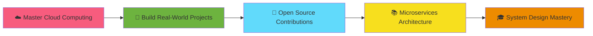

<div align="center">
  
</div>

<div align="center">
  
</div>

<p align="center">
  <a href="https://nayan-portfolio-8dia.vercel.app/" target="_blank">
    
  </a>
  <a href="https://www.linkedin.com/in/nayan-chaudhary-99b126317/" target="_blank">
    
  </a>
  <a href="https://x.com/NayanChy1234" target="_blank">
    
  </a>
  <a href="mailto:nayanchaudhary1010@gmail.com">
    
  </a>
  <a href="https://www.facebook.com/profile.php?id=100079685526753" target="_blank">
    
  </a>
</p>

<p align="center">
  
  
  
</p>

---


### 👨‍💻 About Me

```java
public class NayanChaudhary {
    private String location = "Kathmandu, Nepal";
    private String currentRole = "Full Stack Developer";
    private String[] expertise = {"Java", "Spring Boot", "React JS"};
    
    public String getCurrentProject() {
        return "Community EV Station Platform";
    }
    
    public String getLearningFocus() {
        return "Cloud Computing ☁️ | AWS";
    }
    
    public String getCollaborationInterest() {
        return "Backend Development with Java & Spring Boot";
    }
    
    public String get2026Goal() {
        return "Build impactful real-world solutions ";
    }
}
```

<br clear="right"/>

---

## 🎯 Current Focus

<table>
  <tr>
    <td>🔭 <b>Working On</b></td>
    <td>Community EV Station Platform</td>
  </tr>
  <tr>
    <td>🌱 <b>Learning</b></td>
    <td>Cloud Computing, AWS, Microservices</td>
  </tr>
  <tr>
    <td>👯 <b>Collaboration</b></td>
    <td>Backend projects using Java & Spring Boot</td>
  </tr>
  <tr>
    <td>💬 <b>Ask Me About</b></td>
    <td>Java, Spring Boot, React, REST APIs, MySQL</td>
  </tr>
  <tr>
    <td>⚡ <b>Fun Fact</b></td>
    <td>Clean code gives me peace.</td>
  </tr>
</table>

---

## 🛠️ Technology Arsenal

<div align="center">

### 💻 Languages
<p>
  
  
  
  
  
  
</p>

### 🚀 Frameworks & Libraries
<p>
  
  
  
</p>

### 🗄️ Database
<p>
  
</p>

### ⚙️ Tools & Platforms
<p>
  
  
  
  
  
  
</p>

</div>


<div align="center">
  <picture>
    <source media="(prefers-color-scheme: dark)" srcset="https://raw.githubusercontent.com/nayanchy123456/nayanchy123456/output/github-contribution-grid-snake-dark.svg">
    <source media="(prefers-color-scheme: light)" srcset="https://raw.githubusercontent.com/nayanchy123456/nayanchy123456/output/github-contribution-grid-snake.svg">
    
  </picture>
</div>

---

## 💼 Featured Projects

<div align="center">

### 🌟 Pinned Repositories

<a href="https://github.com/nayanchy123456/Task-Manager">
  
</a>

<a href="https://github.com/nayanchy123456/NEA-Website">
  
</a>

<a href="https://github.com/nayanchy123456/Tic-Tac-Toe">
  
</a>

<a href="https://github.com/nayanchy123456/weatherApplication">
  
</a>

</div>

---

## 🎨 Project Showcase

<details>
<summary><b>📋 Task Manager - Full Stack Application</b></summary>
<br>

A comprehensive task management system with automatic status tracking and deadline monitoring.

**✨ Key Features:**
- ✅ Create, read, update, and delete tasks
- 🕐 Automatic overdue detection based on due dates
- 📊 Smart categorization: Pending, Completed, and Overdue
- 🎯 Real-time task statistics dashboard
- 🔄 RESTful API architecture

**🛠️ Tech Stack:**
- **Backend:** Java, Spring Boot, REST API, MySQL
- **Frontend:** React JS, Fetch API, CSS
- **Architecture:** MVC pattern with separate frontend/backend

</details>

<details>
<summary><b>⚡ NEA Website - Internship Project</b></summary>
<br>

Official website developed during internship at Nepal Electricity Authority.

**✨ Key Features:**
- 🎨 Modern, creative UI/UX design
- 📱 Fully responsive across all devices
- ⚡ Fast loading and optimized performance
- 🎯 User-friendly navigation
- 💼 Professional and clean interface

**🛠️ Tech Stack:**
- **Frontend:** React JS
- **Styling:** Modern CSS with contemporary design patterns
- **Deployment:** Vercel

</details>

<details>
<summary><b>🎮 Tic-Tac-Toe Game</b></summary>
<br>

Classic game implementation with clean code and smooth gameplay.

**✨ Key Features:**
- 🎯 Two-player interactive gameplay
- 🏆 Win detection algorithm
- 🔄 Reset game functionality
- 💡 Clean and intuitive UI
- 📱 Responsive design

**🛠️ Tech Stack:**
- **Frontend:** HTML, CSS, JavaScript
- **Logic:** Vanilla JavaScript with DOM manipulation

</details>

<details>
<summary><b>🌤️ Weather Application</b></summary>
<br>

Real-time weather information app with live data integration.

**✨ Key Features:**
- 🌍 Real-time weather data
- 🔍 Search by city name
- 📊 Detailed weather information
- 🎨 Clean and modern interface
- 📱 Responsive design

**🛠️ Tech Stack:**
- **Frontend:** React JS
- **API Integration:** Weather API with Fetch
- **Styling:** Modern CSS

</details>

## 💭 Developer Quote

<div align="center">
  
</div>

---

## 🎯 2026 Roadmap



---

## 🤝 Let's Connect & Collaborate!

<div align="center">

### 💬 I'm always excited to discuss:

🔹 **Java & Spring Boot** best practices  
🔹 **Full Stack Development** projects  
🔹 **Cloud Computing** & AWS  
🔹 **Open Source** collaboration opportunities  

<br>

### 📫 Reach Out To Me

<p>
  <a href="mailto:nayanchaudhary1010@gmail.com">
    
  </a>
  <a href="https://www.linkedin.com/in/nayan-chaudhary-99b126317/">
    
  </a>
  <a href="https://nayan-portfolio-8dia.vercel.app/">
    
  </a>
</p>

<br>

**📍 Location:** Kathmandu, Nepal  
**💼 Open to:** Backend Development Opportunities | Collaborations | Freelance Projects

</div>

---

<div align="center">
  
</div>

<div align="center">
  <i>⭐️ From <a href="https://github.com/nayanchy123456">nayanchy123456</a> with ❤️</i>
</div>
